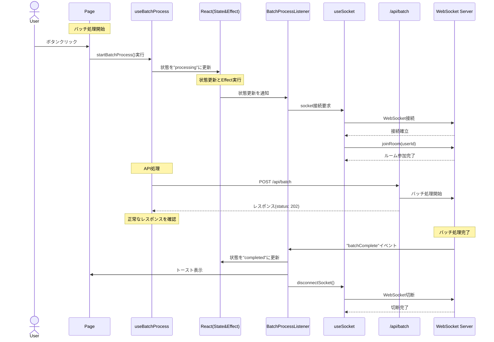

```mermaid
sequenceDiagram
    actor User
    participant Page
    participant BatchHook as useBatchProcess
    participant React as React(State&Effect)
    participant BatchListener as BatchProcessListener
    participant SocketHook as useSocket
    participant API as /api/batch
    participant Server as WebSocket Server

    Note over Page: バッチ処理開始
    User->>Page: ボタンクリック
    Page->>BatchHook: startBatchProcess()実行
    BatchHook->>React: 状態を"processing"に更新

    Note over React: 状態更新とEffect実行
    React->>BatchListener: 状態更新を通知
    BatchListener->>SocketHook: socket接続要求
    SocketHook->>Server: WebSocket接続
    Server-->>SocketHook: 接続確立
    SocketHook->>Server: joinRoom(userId)
    Server-->>SocketHook: ルーム参加完了

    Note over BatchHook: API処理
    BatchHook->>API: POST /api/batch
    API->>Server: バッチ処理開始
    API-->>BatchHook: レスポンス(status: 202)
    Note over BatchHook: 正常なレスポンスを確認

    Note over Server: バッチ処理完了
    Server->>BatchListener: "batchComplete"イベント
    BatchListener->>React: 状態を"completed"に更新
    BatchListener->>Page: トースト表示
    BatchListener->>SocketHook: disconnectSocket()
    SocketHook->>Server: WebSocket切断
    Server-->>SocketHook: 切断完了
```
